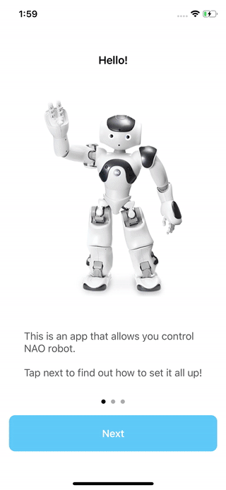

# Nao

This is an iOS application built with Swift that allows to control Nao robot.

## Getting Started

To set it up, make sure you your robot operates in the same WiFi network your iPhone. Use python script provided `nao.py` and run it using Python box in Choregraphe Suite. During the setup stage use IP address of your robot.

## Built With

* [RxSwift](https://github.com/ReactiveX/RxSwift) - ReactiveX for Swift
* [SnapKit](https://github.com/SnapKit/SnapKit) - Swift Autolayout DSL
